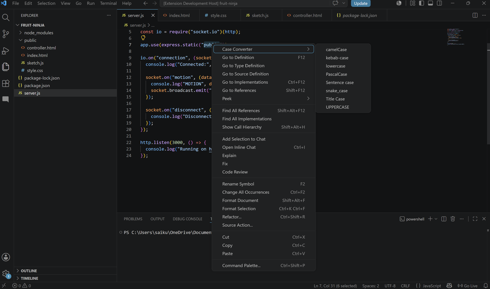

# Case Converter

A Visual Studio Code extension to quickly convert selected text into different case formats.

## Features

- camelCase
- PascalCase
- snake_case
- kebab-case
- UPPERCASE
- lowercase
- Title Case
- Sentence case

## Usage

1. Select any text in the editor.
2. Right-click the selection.
3. Hover over **Case Converter**.
4. Choose the desired format.

## Screenshots

## Supported Conversions

- camelCase
- PascalCase
- snake_case
- kebab-case
- UPPERCASE
- lowercase
- Title Case
- Sentence case

## License

MIT